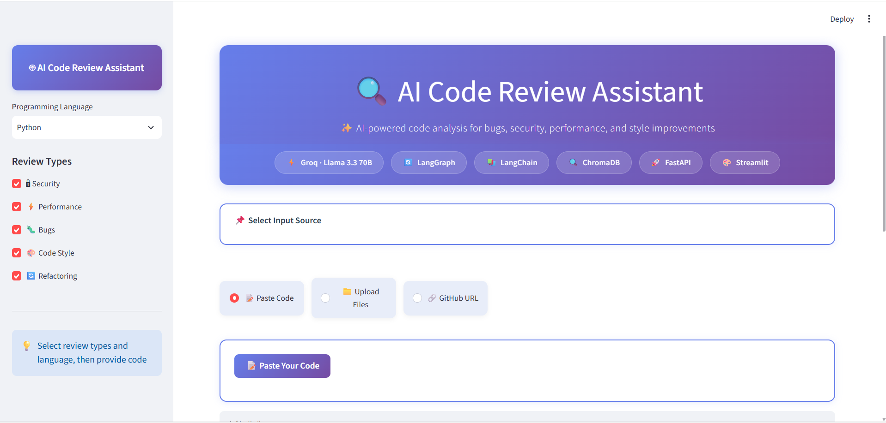
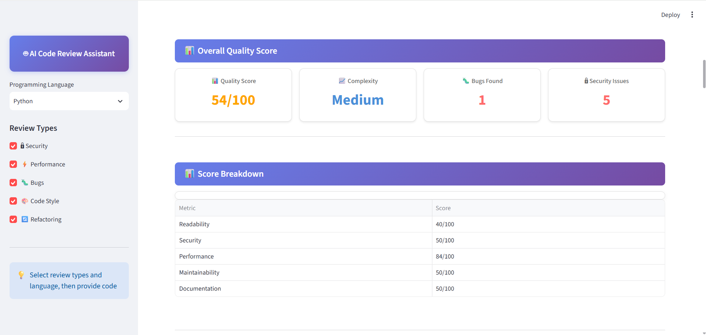
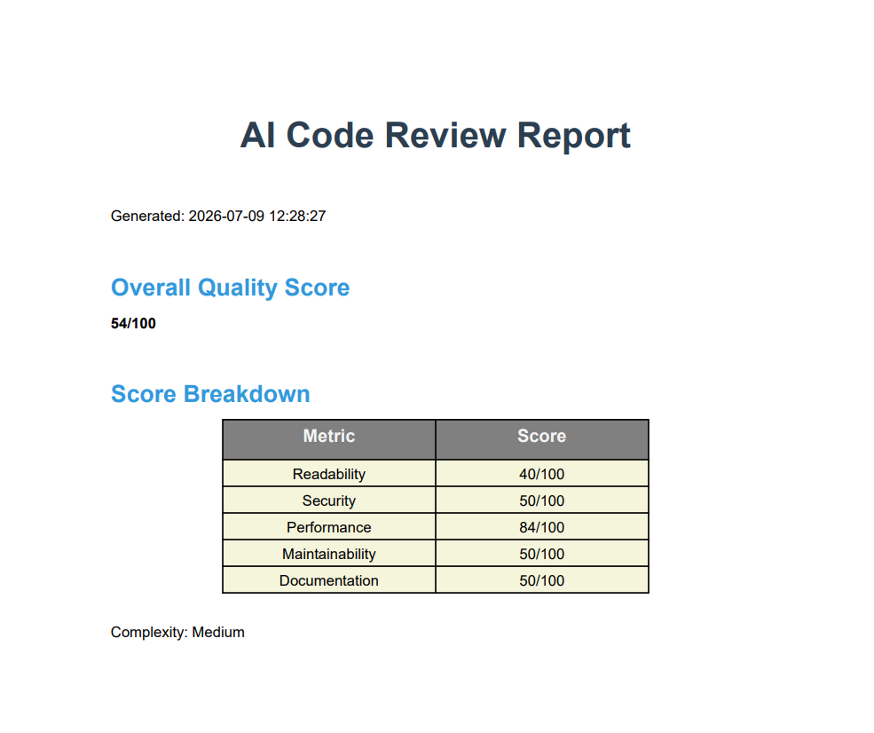

# 🔍 AI Code Review Assistant

An AI-powered **Code Review System** built on an **8-Agent LangGraph Pipeline** that analyzes source code for bugs, security vulnerabilities, performance issues and style violations — from pasted code, uploaded files, or a live GitHub repository.

The system integrates **Groq LLaMA (via LangChain-Groq)** for AI code understanding and refactoring synthesis, **ChromaDB + Sentence-Transformers** for semantic similarity search against known vulnerable code patterns, and **ReportLab** for downloadable PDF reports — all orchestrated by **LangGraph** in a sequential 8-agent pipeline, served through a **FastAPI** backend and a **Streamlit** frontend.

Each agent has a single focused responsibility and passes its findings forward to the next stage, culminating in a consolidated quality score, issue breakdown, and downloadable PDF report.

---

## 🚀 Key Highlights

- 🤖 **Multi-Agent Orchestration** using **LangGraph** (8 sequential nodes)
  
- 🧠 **AI Code Understanding & Refactoring** using **Groq LLaMA** (via LangChain-Groq)
  
- 🔍 **Rule-Based Static Analysis** for bugs, security, performance and style (regex/pattern-based)
  
- 🧬 **Semantic Pattern Matching** via **ChromaDB** + `all-MiniLM-L6-v2` sentence embeddings
  
- 📁 **Multi-Source Input** — paste code, upload files, or point at a GitHub repo URL
  
- 📄 **Downloadable PDF Reports** generated with **ReportLab**
  
- 🖥️ **Interactive Web UI** built with **Streamlit**
  
- 🚀 **REST API Backend** built with **FastAPI**

---

## ⭐ Key Features

- **Multi-Source Code Ingestion** — analyze code pasted directly into the UI, uploaded files (`.py`, `.java`, `.js`, `.cpp`, `.go`, `.rs`, `.txt`), or an entire public GitHub repository (shallow-cloned on demand)
  
- **Static Analysis Engine** — dedicated detectors for bugs (e.g. division-by-zero, infinite loops), security issues (hardcoded credentials, SQL/command injection, weak crypto, unsafe deserialization), performance issues (nested loops, inefficient iteration), and style issues (line length, magic numbers, missing docstrings)
  
- **AI-Assisted Understanding** — a Groq-backed LLM node summarizes what a code snippet does, estimates complexity, and states its purpose (for snippets under a length threshold)
  
- **AI-Assisted Refactoring** — a second LLM node proposes refactored code and explanations based on the issues found by the static analyzers
  
- **Vector Similarity Search** — ChromaDB compares submitted code against a seeded set of known vulnerable/inefficient patterns to surface related issues and fixes
  
- **Consolidated Multi-File Reporting** — when reviewing a GitHub repo or multiple uploaded files, results are deduplicated and merged into one overall quality report
  
- **Quality Scoring** — computes an overall score plus a readability / security / performance / maintainability / documentation breakdown
  
- **Scalable Architecture** — modular agent design makes it easy to add new agents (e.g. a Dependency Agent or Complexity Agent)

---

## 🧠 System Architecture

```
User Query (Code / File / GitHub URL)
    ↓
Code Understanding Agent  →  Groq LLaMA (LangChain)
    ↓
Bug Detection Agent       →  Regex-based Static Analysis
    ↓
Security Analysis Agent   →  Regex-based Static Analysis
    ↓
Performance Analysis Agent → Regex-based Static Analysis
    ↓
Style Analysis Agent      →  Regex-based Static Analysis
    ↓
Similar Patterns Agent    →  ChromaDB (Sentence-Transformers)
    ↓
Refactoring Agent         →  Groq LLaMA (LangChain)
    ↓
Report Generation Agent   →  Score Aggregation + ReportLab PDF
```

Each agent receives and enriches the shared LangGraph state, with a single, consolidated report emitted at the end of the pipeline.

---

## 🔹 Agent Details

### 🧩 Code Understanding Agent — Groq LLaMA
Sends the submitted code (up to ~2000 characters) to the LLM with a prompt asking for a one-to-two sentence summary, a complexity rating (Low/Medium/High), and the code's main purpose. Skipped automatically for longer snippets or when no API key is configured, in which case this section of the report is left empty.

---

### 🐛 Bug Detection Agent — Regex Static Analysis
Scans line-by-line for patterns such as potential division-by-zero and `while True` / `while 1` loops with no detectable `break` within the following lines, flagging them as critical/high severity bugs.

---

### 🔒 Security Analysis Agent — Regex Static Analysis
Matches lines against known-risk patterns: hardcoded credentials, string-concatenated SQL queries, `os.system`/`subprocess`/`eval`/`exec` calls, weak hashing algorithms (MD5/SHA1/DES), and `pickle` usage — each mapped to a severity level and a remediation tip.

---

### ⚡ Performance Analysis Agent — Regex Static Analysis
Flags deeply nested loops (via a simple lookahead count of `for` keywords) and `range(len(...))` usage as an opportunity to use `enumerate()`.

---

### 🎨 Style Analysis Agent — Regex Static Analysis
Flags lines over 100 characters, likely "magic numbers," and functions/classes missing a docstring on the line immediately following their definition.

---

### 🧬 Similar Patterns Agent — ChromaDB + Sentence-Transformers
Embeds the submitted code with `all-MiniLM-L6-v2` and queries a persistent ChromaDB collection seeded with common vulnerable/inefficient code patterns (hardcoded secrets, SQL injection, command injection, `eval`, inefficient loops), returning the closest matches with their known issue and fix.

---

### 🔄 Refactoring Agent — Groq LLaMA
Feeds all bugs/security/performance/style findings (up to 10) plus the original code (up to ~1500 characters) to the LLM, requesting refactored code, explanations and improvements as JSON. Falls back to a templated bullet-point summary if the LLM is unavailable, the code is too long, or the JSON response can't be parsed.

---

### 📄 Report Generation Agent — Scoring + ReportLab
Aggregates all findings into a quality score and a five-category breakdown (readability, security, performance, maintainability, documentation), then hands the consolidated report off to `ReportGenerator` to render a downloadable PDF via **ReportLab**.

---

## 🏗️ Project Structure

```
AI_Code_Review_Assistant/
├── main.py            # FastAPI app entrypoint
├── agents.py           # LangGraph pipeline — 8 agents
├── app.py               # Streamlit web UI
├── reviewers.py          # Regex-based bug/security/performance/style detectors
├── parser.py              # Regex-based function/class/import/comment parsing
├── chroma_store.py         # ChromaDB pattern storage + similarity search
├── report.py                # ReportLab PDF report generation
├── requirements.txt
└── .env
```

---

## ⚙️ Tech Stack

| Category | Technology |
|---|---|
| LLM | Groq — LLaMA (via `langchain-groq`) |
| Agent Orchestration | LangGraph |
| Framework | LangChain |
| Vector Store / Similarity Search | ChromaDB + Sentence-Transformers (`all-MiniLM-L6-v2`) |
| Static Analysis | Regex / pattern matching (Python `re`) |
| Source Parsing | Custom regex parser (`tree-sitter` listed as a dependency but not currently used) |
| PDF Reporting | ReportLab |
| Backend | FastAPI |
| Frontend | Streamlit |
| Repo Ingestion | Git (via `subprocess`, shallow clone) |
| Data Handling | Pandas |

---

## 🔑 API Keys Required

| Service | Link |
|---|---|
| Groq | https://console.groq.com |

---

## 🔐 Environment Variables

Create a `.env` file in the project root:

```env
GROQ_API_KEY=your_groq_api_key
API_URL=http://localhost:8000
DEBUG=True
```

---

## 🧪 Installation & Setup

### 1. Clone the repository

```bash
git clone https://github.com/your-username/AI-Code-Review-Assistant.git
cd AI-Code-Review-Assistant
```

### 2. Create and activate virtual environment

```bash
python -m venv venv
venv\Scripts\activate        # Windows
source venv/bin/activate     # macOS / Linux
```

### 3. Install dependencies

```bash
pip install -r requirements.txt
```

### 4. Set up environment variables

Copy the `.env` example above into a `.env` file in the project root and add your Groq API key.

---

## ▶️ Run the Application

Start the FastAPI backend:

```bash
python main.py
```

In a separate terminal, start the Streamlit frontend:

```bash
streamlit run app.py
```

---

## 💡 Example Inputs

```
Paste a Python function and review for bugs, security and performance
```
```
Upload a .java file and check for style and documentation issues
```
```
https://github.com/username/example-repo — review the whole repository for security issues
```

---

## 🖥️ UI Preview

### 🏠 Homepage


### 🤖 Analysis Results


### 📄 PDF Report


---

## 🎯 Use Cases

- Multi-Agent AI System Demonstration
- Static Analysis + LLM-Assisted Review Project
- Portfolio Project for AI/ML or Backend Roles
- Base for Building a Production Code Review Tool

---

## 👨‍💻 Author

**Your Name**

LinkedIn: https://www.linkedin.com/in/your-profile

GitHub: https://github.com/your-username
